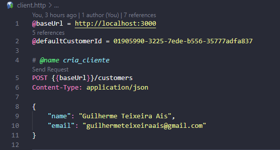
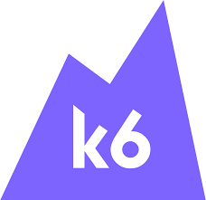
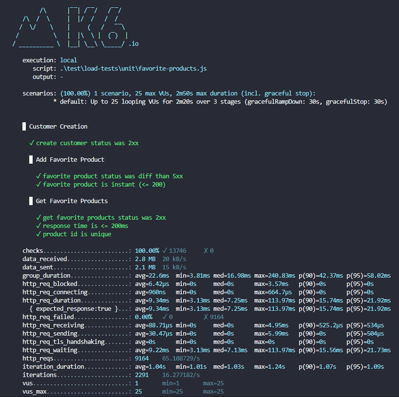
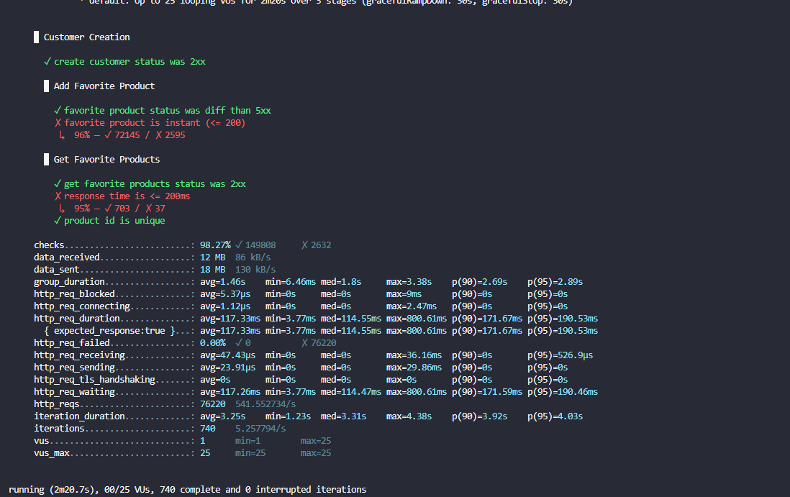
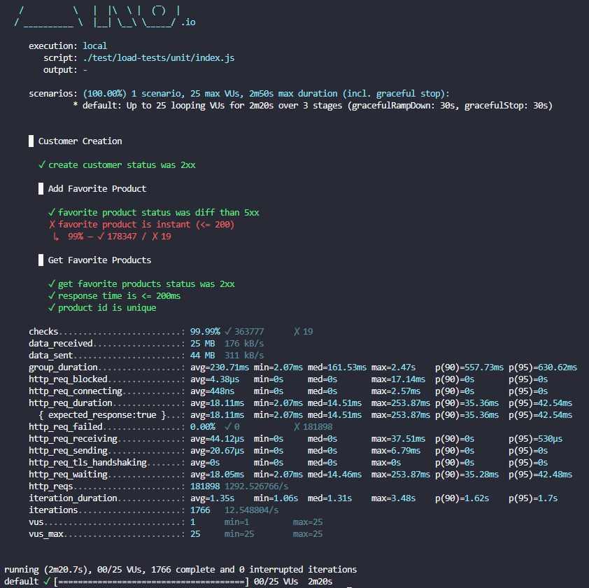

# Labs Challenge 🏪

## Descrição 📖
Este projeto foi desenv olvido utilizando NestJS e MongoDB, seguindo a arquitetura hexagonal, conceitos de arquitetura limpa e Domain-Driven Design (DDD). Inclui uma suíte de testes completa com testes unitários, de integração e end-to-end (E2E) utilizando Vitest e Testcontainers. Além disso, há uma suíte de testes de carga em desenvolvimento com K6.

## Requisitos 📋
- Node.js
- npm
- Instância MongoDB (para execução sem Docker)
- Docker (para execução com Docker)

## Instalação e execução do projeto 🚀

### Método Manual
1. Clone o repositório:
    ```bash
    git clone <URL do seu repositório>
    cd <nome do repositório>
    ```
2. Instale as dependências:
    ```bash
    npm install
    ```
3. Configure o arquivo `.env` com as variáveis `PRODUCTS_SERVICE_URL` e `MONGO_URI` conforme o `.env.example`. A variável `MONGO_URI` deve conter a URL da sua instância MongoDB.

4. Execute a aplicação em modo de desenvolvimento:
    ```bash
    npm run start:dev
    ```

### Com Docker
1. Clone o repositório:
    ```bash
    git clone <URL do seu repositório>
    cd <nome do repositório>
    ```
2. Configure o arquivo `.env` com as variáveis `PRODUCTS_SERVICE_URL` conforme o `.env.example`.

3. Execute a aplicação com Docker:
    ```bash
    docker-compose up
    ```

## Testando as Rotas da Aplicação 🛠️
Para testar todas as rotas da aplicação, você pode utilizar o arquivo **[client.http](client.http)** incluído no projeto. Siga os passos abaixo:
- Instale a extensão Rest Client do VS Code (humao.rest-client).
- Abra o arquivo client.http.
- Utilize os comandos no arquivo para testar as diferentes rotas da aplicação.
O arquivo após a instalação da extensão ficará mais ou menos assim:


## Executando a Suíte de Testes Automatizados 🧪 

### Testes Unitários
Para rodar os testes unitários:
```bash
npm run test:watch
```

### Testes End-to-End e de integração (E2E)
Para rodar os testes E2E (⚠️ Docker precisa estar em execução):
```bash
npm run test:e2e
```

### Testes com Coverage
Para rodar toda a suíte de testes e gerar o relatório de cobertura de testes (⚠️ Docker precisa estar em execução):
```bash
npm run test:cov
```

## Testes de carga 💪🏻
Utilizei o K6 para realizar testes de carga no sistema.
<p align="center">
  
</p>

[Clique aqui](./test/load-tests/unit/favorite-products.js) para ver o script que gera o teste de carga no fluxo de **criação de cliente e a adição de proutos aos favoritos** 

### Como rodar os testes de stress
⚠️ Para roda-los, primeiro, a aplicação já tem que estar rodando na porta 3000!
```bash
npm run test:load
```
### Ultimo resultado rodando na minha máquina 📋
Nesse teste, o cenário de favoritar um produto fazia com que cada cliente cadastrado favoritasse somente 1 produto! Obtendo um `p(95) de 21.92ms` e `65 requisições por segundo`, um resultado ok já que estou rodando tudo na minha máquina (1 instância mongodb, 1 do node)!
<p align="center">
  
</p>

### Deixando o teste mais realista e estressante 🔥
No mesmo cenário de favoritar produtos, fiz com que todos clientes favoritassem **100 produtos** e não somente **1**, isso fez com que aumentassemos a quantidade de requisições de **9164** (ultimo teste) para **76220 (541 req/seg)** ! Esse aumento massivo de requisições, fez com que o `p(95)` aumentasse de **21.92ms** para **190.53ms** 
<p align="center">
  
</p>

### Algumas melhorias 🔧
Após aplicar algumas melhorias como:
- Adicionar fastify;
- Clusterizar a aplicação;
- Adicionar cache em pontos especificos que o mongodb era acessado;
- Passa nível de log (variável `LOG_LEVEL`) para somente erros.

Essas melhorias causaram drastivas melhorias, onde:
- Aplicação conseguiu aceitar **181988** requisições **(1292 req/seg)**. Antes das melhorias, conseguia aceitar somente **76220 (541 req/seg)**;
- Abaixou o `p(95)`de **190.53ms** para **42.94ms**.
<p align="center">
  
</p>
